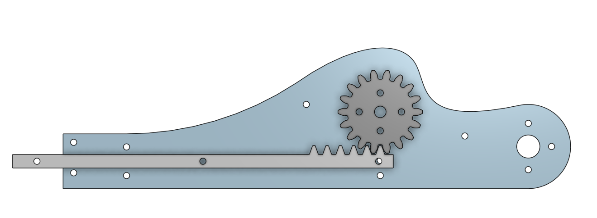
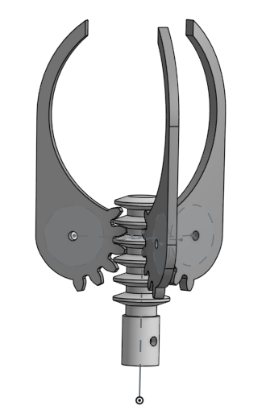
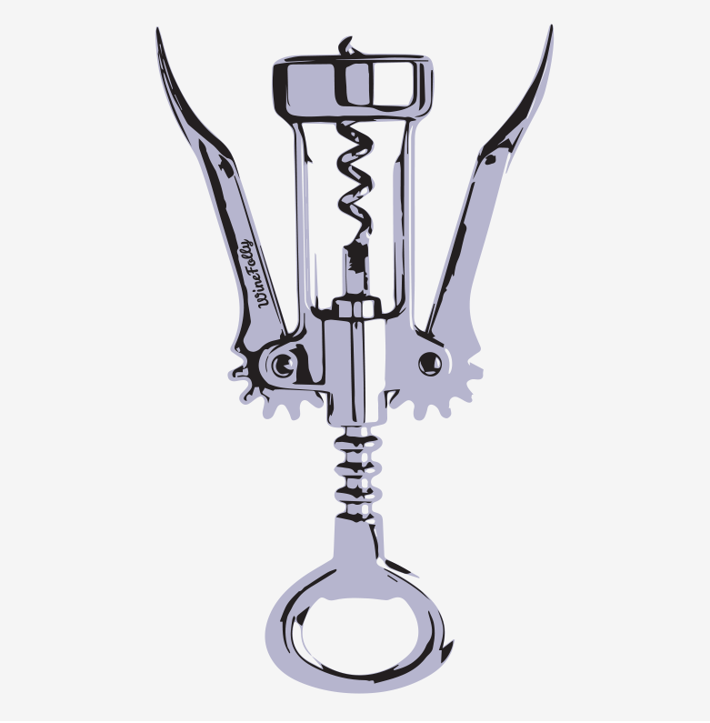
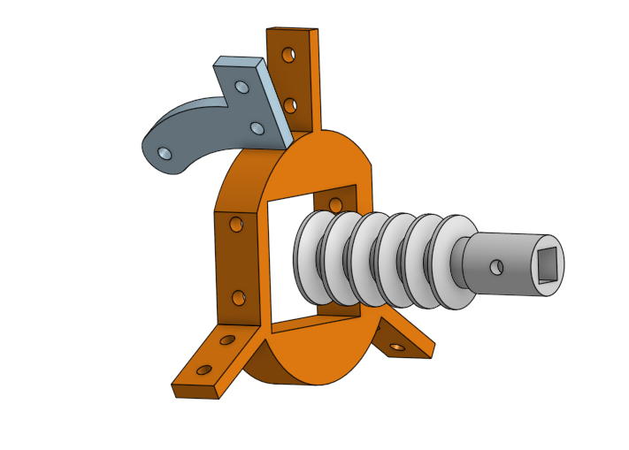
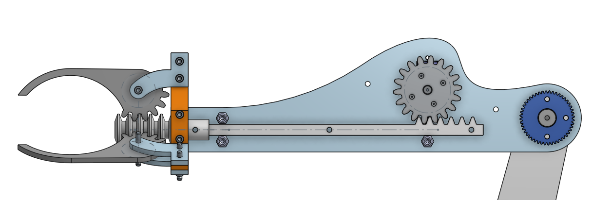
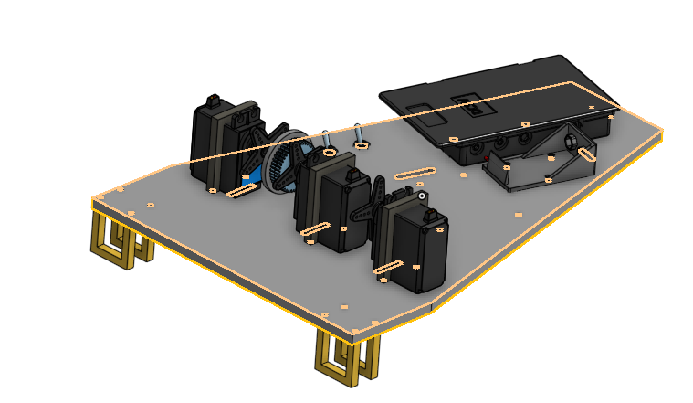
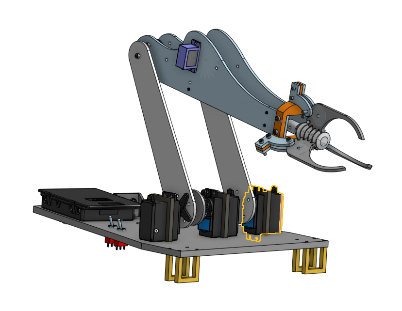

# Clawcar Project

## Preface

For this project, we were assigned to create something that uses a robot arm. Our constraints consisted of 2 months of time and materials available in the lab or any materials that could be easily obtained. We had access to hardware, servos, motors, acrylic, a laser cutter, and 3D printers to create our robot.

## Planning_Stage

[Planning Document](https://docs.google.com/document/d/18APe1ReYu_2JsjmeK-9Reznoc6AoXzXg0CE4DWNOTgk/edit?usp=sharing)

Inital problems we faced in planning our project were deciding whether to control the car via Bluetooth or an infrared universal TV remote. We also didn't know whether we wanted to use a SCARA arm or an articulated arm. We ended up choosing infrared over Bluetooth because Bluetooth seemed overly complicated and unnecessary for what we were trying to achieve, and we chose an articulated arm over a SCARA arm because a SCARA arm didn't seem like it would be strong enough to lift anything vertically while also moving horizontally. 

## CAD

[Onshape Document](https://cvilleschools.onshape.com/documents/68aa0f638d08d1c7e2145037/w/4b7c45ff2284ca1a7005927c/e/ad726c20be8d60d7ba291cb8?renderMode=0&uiState=628e30d8a4cb37411039c9b7)

#### Rack and Pinion

The first piece of this CAD project was to design a rack and pinion for the claw to open and close with a single 180 micro-servo. In order to create it, I used a spur gear function on Onshape, and then designed a gear rack off of the geometry of the gear. Using a rack and pinion mate allowed the gear to turn while the rack moved back and forth. Lastly, walls to mount the rack onto were designed, with a hole on one side to connect the servo.




---------------------------------------------------------------------------------------------------------------------------------------------------------------------------------

#### Claw Fingers
The next piece of the project was designing the claw fingers, which are pieces of gear with curved grab fingers (Shown below). These fingers have gears on the back end, which connect to a cylindrical gear rack on the end of the rack and pinion assembly. This was designed after a wine bottle opener.

 


---------------------------------------------------------------------------------------------------------------------------------------------------------------------------------

#### Bracket Connector
This bracket was somewhat difficult to design, because it had to be able to hold the three claw fingers in a circular orientation split evenly around a circle. Additionally, the square hole in the center had to be offset to account for the offset of the rack attached to the micro-servo.




---------------------------------------------------------------------------------------------------------------------------------------------------------------------------------

#### Full Upper Arm
This image shows the upper arm and claw assembly, which includes a gear at the elbow that uses a belt to connect to a servo on the car base. This belt allows for rotation of the upper arm around an axis. The lower arm bends back and forth by two servos working in parallel, in order for extra strength (shown in Car Base).




---------------------------------------------------------------------------------------------------------------------------------------------------------------------------------

#### Car Base
This is the car base rendered in CAD, complete with screw holes, battery holders, motor mounts, servos, and switches.




---------------------------------------------------------------------------------------------------------------------------------------------------------------------------------

#### Completed Assembly
This is the completed car, arm, and claw rendered in CAD. It does not show the motors and belts because we could not find them in the parts folder we have access to.




---------------------------------------------------------------------------------------------------------------------------------------------------------------------------------

## Code

#### The code below shows a shorter version for simplicity. For the full code, look at [Code version 1.0](clawcar1.0.py)
The code works by reading pulses from an infrared remote. To find the pulse values of your remote, use 
[this code](https://github.com/sfunk02/clawcar/blob/main/ircode.py) 
to find values to put in the beginning of your code as follows. Once you find oulse values and input them as an array at the beginning of your code, the pulse decoder should be able to read the remotes input and respond. This code uses a fuzzyness of .2 or 20% margin of error while reading pulses, and uses an if statement so if a button is hit, a motor or servo moves.
``` python
p1 = [1184, 977, 2239]
print('IR listener')
def fuzzy_pulse_compare(pulse1, pulse2, fuzzyness=0.2):
    if len(pulse1) != len(pulse2):
        return False
    for i in range(len(pulse1)):
        threshold = int(pulse1[i] * fuzzyness)
        if abs(pulse1[i] - pulse2[i]) > threshold:
            return False
    return True

pulses = pulseio.PulseIn(IR_PIN, maxlen=200, idle_state=True)
decoder = adafruit_irremote.GenericDecode()
pulses.clear()
pulses.resume()

while True:
    detected = decoder.read_pulses(pulses)
    if fuzzy_pulse_compare(pu, detected):
        print('up')
        print("\nForwards slow")
        A1 = board.D4
        A2 = board.D5
        pwmA1 = pwmio.PWMOut(A1, frequency=50)
        pwmA2 = pwmio.PWMOut(A2, frequency=50)
        motor1 = motor.DCMotor(pwmA1, pwmA2)
        B1 = board.D7
        B2 = board.D6
        pwmB1 = pwmio.PWMOut(B1, frequency=50)
        pwmB2 = pwmio.PWMOut(B2, frequency=50)
        motor2 = motor.DCMotor(pwmB1, pwmB2)
        motor1.throttle = 0.5
        print("  throttle:", motor1.throttle)
        motor2.throttle = 0.5
        print("  throttle:", motor2.throttle)
    if fuzzy_pulse_compare(pd, detected):
        print('down')
        print("\nBackwards")
        A1 = board.D4
        A2 = board.D5
        pwmA1 = pwmio.PWMOut(A1, frequency=50)
        pwmA2 = pwmio.PWMOut(A2, frequency=50)
        motor1 = motor.DCMotor(pwmA1, pwmA2)
        B1 = board.D7
        B2 = board.D6
        pwmB1 = pwmio.PWMOut(B1, frequency=50)
        pwmB2 = pwmio.PWMOut(B2, frequency=50)
        motor2 = motor.DCMotor(pwmB1, pwmB2)
        motor1.throttle = -0.5
        print("  throttle:", motor1.throttle)
        motor2.throttle = -0.5
        print("  throttle:", motor2.throttle)
    if fuzzy_pulse_compare(p1, detected):
        print('1')
        pwm1 = pulseio.PWMOut(board.D10, frequency=50)
        myServo1 = servo.Servo(pwm1, min_pulse=750, max_pulse=2250)
        pwm2 = pulseio.PWMOut(board.D12, frequency=50)
        myServo2 = servo.Servo(pwm2, min_pulse=750, max_pulse=2250)
        myServo2.angle = 100
        myServo1.angle = 10
        time.sleep(servoDelay)
        pwm1.deinit()
        pwm2.deinit()

```


## Building_the_Robot
For the most part, assembling the final product was fairly straightforward. Mostly everything fit where it was supposed to go. We ran into a few problems, one of which was that the middle servo bracket cracked once screwed in, and we had to replace it. The second was that the arms were difficult to put together in the collar holding the claw, but we ended up resolving this by the end. We were able to slide the pieces together and leave one screw out without sacrificing any major durability.

Additionally, we decided to replace the three 180 servos on the car base with stronger servos to better support the weight of the arm, and the microservo was also replaced 3 times, because it kept breaking.

This was due to a struggle with getting the code for the claw microservo to work; the range of motion would always push the rod too far, breaking the servo.
In order to fix this, we tested smaller ranges of motion, so if the code was faulty, it would not damage the mechanics.

## Completed Version 1.0
[Full Video](Images/Clawcarvideo1.mp4)


## Version 1.1

### Updates to hardware

* Tower Pro SG92R microservo broke, and was replaced.
* CYS S3003 Servos were replaced with the Tiankongrc MG996R Servos. The new servos have metal components in order to provide greater torque, which allows smoother function of the arms.

### Updates to Code
Code was cleaned up for clarity; the previous version was very clunky and repetitive. The function of the updated code is identitical, apart from minor tweaks and bug fixes.

#### The code below shows a basic function for one arm motion (button 1). For the full code, look at [Code version 1.1](clawcar1.1.py)

``` python
p1 = [1184, 977, 2239]

pwm1 = pulseio.PWMOut(board.D10, frequency=50)
myServo1 = servo.Servo(pwm1, min_pulse=750, max_pulse=2250)
pwm2 = pulseio.PWMOut(board.D12, frequency=50)
myServo2 = servo.Servo(pwm2, min_pulse=750, max_pulse=2250)

print('IR listener')
def fuzzy_pulse_compare(pulse1, pulse2, fuzzyness=0.2):
    if len(pulse1) != len(pulse2):
        return False
    for i in range(len(pulse1)):
        threshold = int(pulse1[i] * fuzzyness)
        if abs(pulse1[i] - pulse2[i]) > threshold:
            return False
    return True
    
pulses = pulseio.PulseIn(IR_PIN, maxlen=200, idle_state=True)
decoder = adafruit_irremote.GenericDecode()
pulses.clear()
pulses.resume()

if fuzzy_pulse_compare(p1, detected):
       print('1')
       myServo2.angle = 100
       myServo1.angle = 10
       time.sleep(servoDelay)
       pwm1.deinit()
       pwm2.deinit()    

```

### 

### 


