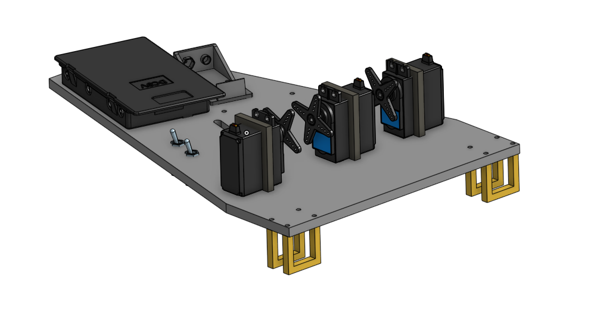

# Clawcar Project

## Table of Contents
* [Table of Contents](#TableOfContents)
* [Introduction](#Introduction)
* [Planning](#Planning_Stage)
* [CAD](#CAD)
* [Code](#Code)
* [Building the Robot](#Building_the_Robot)
* [Final Product](#Final_Product)

## Introduction
For this project, we were assigned to create something that uses a robot arm. Our constraints consisted of 2 months of time and materials available in the lab or any materials that could be easily obtained. We had access to hardware, acrylic, a laser cutter, and 3D printers to create our robot.

## Planning_Stage

[Planning Document](https://docs.google.com/document/d/18APe1ReYu_2JsjmeK-9Reznoc6AoXzXg0CE4DWNOTgk/edit?usp=sharing)

Inital problems we faced in planning our project were deciding whether to control the car via Bluetooth or an infrared universal TV remote. We also didn't know whether we wanted to use a SCARA arm or an articulated arm. We ended up choosing infrared over Bluetooth because Bluetooth seemed overly complicated and unnecessary for what we were trying to achieve, and we chose an articulated arm over a SCARA arm because a SCARA arm didn't seem like it would be strong enough to lift anything vertically while also moving horizontally. 

## CAD

[Onshape Document](https://cvilleschools.onshape.com/documents/68aa0f638d08d1c7e2145037/w/4b7c45ff2284ca1a7005927c/e/dc6fd3a74e3c54772968f738)

The first piece of this CAD project was to design a rack and pinion for the claw to open and close with a single 180 micro-servo. In order to create it, I used a spur gear function on Onshape, and then designed a gear rack off of the geometry of the gear. Using a rack and pinion mate allowed the gear to turn while the rack moved back and forth. Lastly, walls to mount the rack onto were designed, with a hole on one side to connect the servo.

---------------------------------------------------------------------------------------------------------------------------------------------------------------------------------

The next piece of the project was designing the claw fingers, which are pieces of gear with curved grab fingers (Shown below). These fingers have gears on the back end, which connect to a cylindrical gear rack on the end of the rack and pinion assembly. This was designed after a wine bottle opener.

 

---------------------------------------------------------------------------------------------------------------------------------------------------------------------------------

This bracket was somewhat difficult to design, because it had to be able to hold the three claw fingers in a circular orientation split evenly around a circle. Additionally, the square hole in the center had to be offset to account for the offset of the rack attached to the micro-servo.

---------------------------------------------------------------------------------------------------------------------------------------------------------------------------------

---------------------------------------------------------------------------------------------------------------------------------------------------------------------------------

---------------------------------------------------------------------------------------------------------------------------------------------------------------------------------

---------------------------------------------------------------------------------------------------------------------------------------------------------------------------------

## Code

## Building_the_Robot
For the most part, assembling the final product was fairly straightforward. Mostly everything fit where it was supposed to go. We ran into two problems, one of which was that the middle servo bracket cracked once screwed in, and we had to replace it. The second was that the arms were difficult to put together in the collar holding the claw, but we ended up resolving this by the end. We were able to slide the pieces together and leave one screw out without sacrificing any major durability.

Additionally, we decided to replace the three 180 servos on the car base with stronger servos to better support the weight of the arm.

## Final_Product
